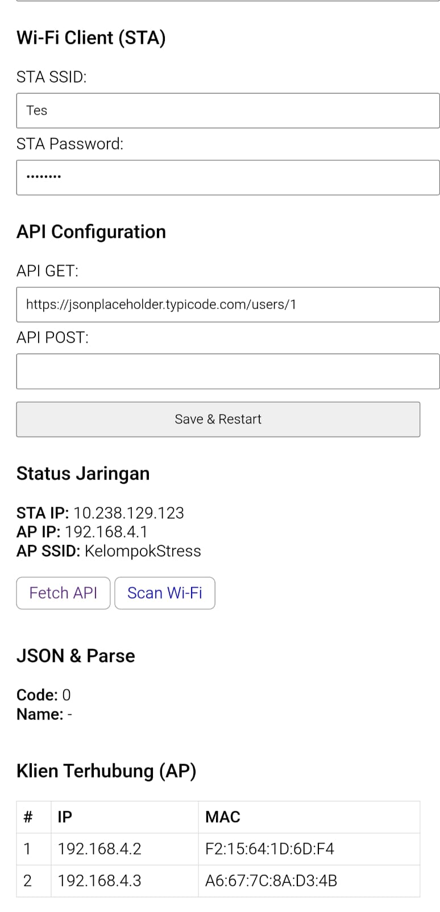
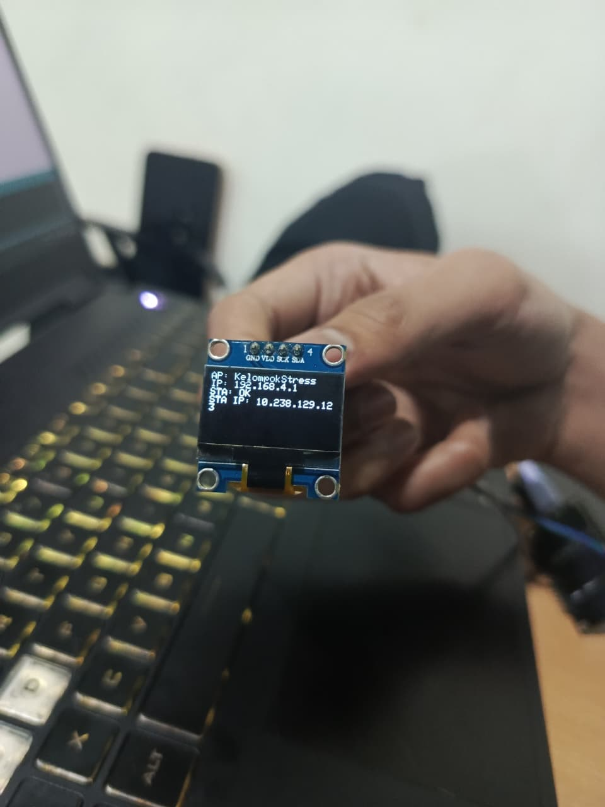

<!-- Social Preview Metadata -->
<meta property="og:title" content="Mini Gateway — Web-Configurable IoT Gateway for ESP8266">
<meta property="og:description" content="Smart dual-mode Wi-Fi gateway with JSON API, web dashboard, and DHCP scanner for Wemos D1 mini. Built with Arduino and ESP8266WebServer.">
<meta property="og:image" content="https://raw.githubusercontent.com/sismadi/mini-gateway/main/docs/banner.png">
<meta property="og:type" content="website">
<meta property="og:url" content="https://github.com/sismadi/mini-gateway">
<meta name="twitter:card" content="summary_large_image">

<!-- Banner -->

  
  
  

# Mini Gateway

**Web-Configurable Dual-Mode IoT Gateway for ESP8266 (Wemos D1 Mini)**  
Smart AP + STA Wi-Fi Node with JSON API, Dynamic Web Portal, and Persistent EEPROM Settings.

---

## Overview
**Mini Gateway** is a lightweight firmware for the **Wemos D1 mini (ESP8266)** that acts as both  
an **Access Point (AP)** and a **Station (STA)** simultaneously.  
It provides a **web-based configuration portal** to set Wi-Fi credentials, API endpoints, and monitor connected clients —  
making it an ideal foundation for **IoT gateways**, **sensor nodes**, or **micro-service bridges**.

---

## Key Features
-  **Dual Wi-Fi Mode** – Operates as both AP and STA (connects to router while hosting setup page).  
-  **Web Configuration Portal** – Access via browser at `http://192.168.4.1`  
  to set:  
  - AP SSID / Password  
  - STA SSID / Password  
  - API GET / POST URLs  
-  **Persistent Storage** – All settings saved in EEPROM.  
-  **JSON API Integration** – Supports HTTPS GET / POST with automatic JSON parsing.  
-  **Wi-Fi Scanner** – Lists nearby SSIDs with RSSI & encryption type.  
-  **DHCP Client List** – Shows IP + MAC of devices connected to AP.  
-  **Lightweight & Extensible** – Easily add sensors, MQTT, or service-layer logic.

---

## Hardware Requirements
| Component | Description |
|------------|--------------|
| **Board** | Wemos D1 Mini (ESP8266) |
| **Power** | 5 V USB / Micro-USB |
| **Optional** | Sensors or actuators connected via GPIO pins |

---

## Pinout (Default)
| Function | Pin | Notes |
|-----------|-----|-------|
| I²C SDA | D2 (GPIO 4) | reserved (for expansion) |
| I²C SCL | D1 (GPIO 5) | reserved (for expansion) |
| Wi-Fi AP | internal | “SoftAP” mode active by default |
| Serial Monitor | 115200 baud | debugging and logs |

---

## Web Portal
Once the firmware is uploaded:

1. The device starts its own Wi-Fi network:  
SSID: SetupD1Mini
Password: 12345678

2. Connect to it and open a browser at **http://192.168.4.1**  
3. You’ll see a configuration dashboard with:
- AP and STA Wi-Fi settings  
- API GET / POST URL inputs  
- Buttons: **Fetch API**, **Scan Wi-Fi**, and **View Connected Clients**
4. All settings persist after reboot.

---

## JSON API Demo
Example using a public JSON placeholder:

GET https://jsonplaceholder.typicode.com/users/1

→ parses field “name” or “title”

Console output:
[GET] OK, parsed name: Leanne Graham
[POST] sent payload: {"device":"D1 mini","rssi":-67,"uptime_ms":123456}

---

## Example Use Cases
- IoT Sensor Hub / Data Logger  
- Local Gateway for Home Automation  
- Configuration Node for Distributed Microservices  
- JSON API bridge for MVCS / Hybrid Architecture research

---

## Project Structure

MiniGateway/
├── MiniGateway.ino → main firmware  
├── README.md → this file  
├── /data/ → optional SPIFFS web assets  
└── /docs/ → documentation or diagrams  

---

## Libraries Used
All available via **Arduino IDE → Library Manager**  
| Library | Purpose |
|----------|----------|
| `ESP8266WiFi` | Wi-Fi control (AP + STA) |
| `ESP8266WebServer` | Web dashboard |
| `ESP8266HTTPClient` | HTTP GET / POST |
| `WiFiClientSecure` | HTTPS support (setInsecure) |
| `EEPROM` | Persistent configuration |
| `ArduinoJson` | JSON serialization / deserialization |

---

## Security Notes
- For local networks, HTTPS uses `setInsecure()` for flexibility;  
  for production use, integrate certificate pinning or MQTT TLS.
- Avoid weak AP passwords; change via web portal.

---

## Future Extensions
- [ ] Add MQTT client (publish sensor data)  
- [ ] Add OTA update system  
- [ ] Integrate with Supabase / Cloudflare Workers service layer  
- [ ] JSON-driven UI presets (MVCS model integration)  
- [ ] Logging & telemetry dashboard

---

## Author
**Wawan Sismadi**  
Doctoral Research in Informatics — Hybrid MVCS Architecture for LMS and IoT Systems  
Universitas Ahmad Dahlan | [GitHub @ sismadi](https://github.com/sismadi)

---

## License
This project is released under the **MIT License**.  
You are free to use, modify, and distribute it for academic or personal purposes.

---

## Citation (for academic use)
If used in research or coursework:

> Sismadi, W. (2025). *Mini Gateway: Web-Configurable Dual-Mode IoT Gateway for ESP8266.*  
> Experimental prototype for Hybrid MVCS Architecture in IoT systems.

---

